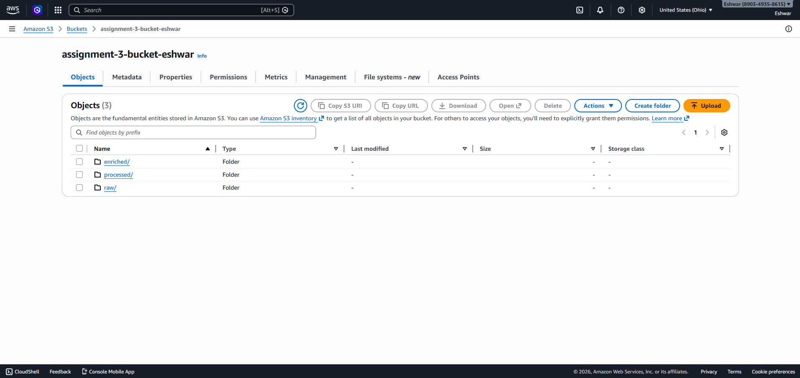
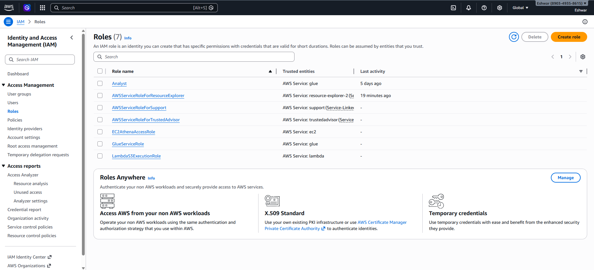
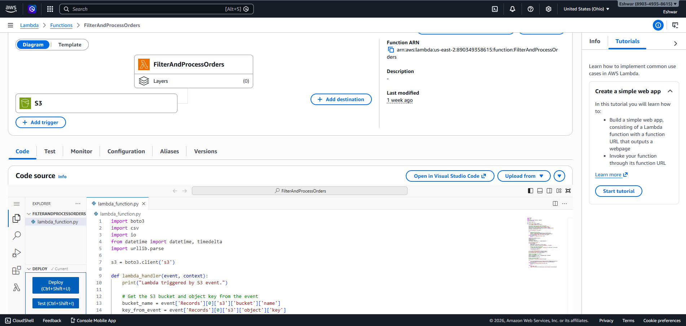
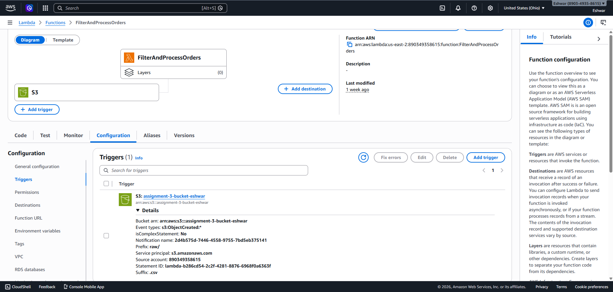
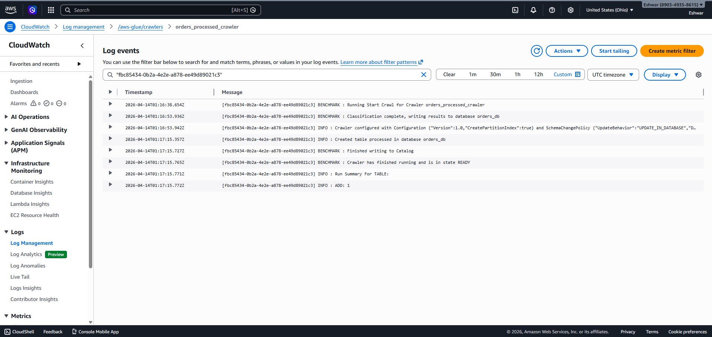
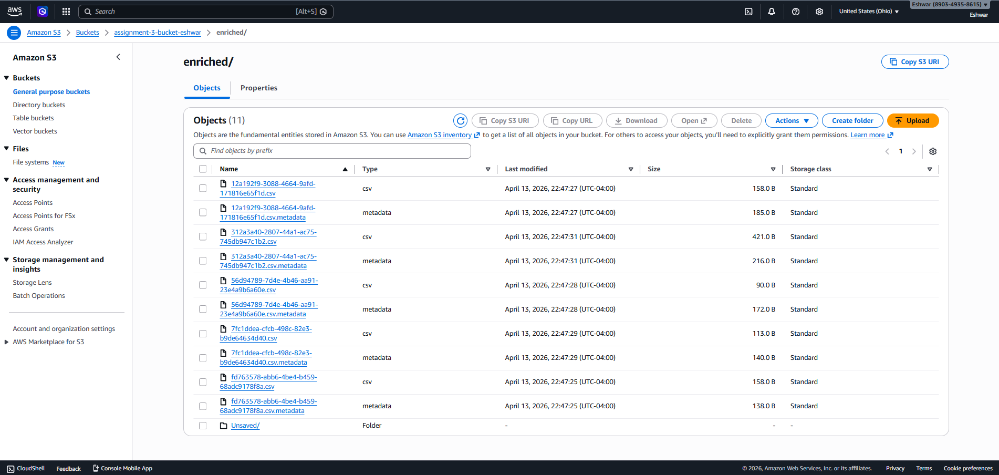

# ITCS-6190 Assignment 3: AWS Data Processing Pipeline

## 📊 Project Overview

This project demonstrates an end-to-end serverless data processing pipeline on AWS. The architecture includes:

1. **Data Ingestion**: Raw CSV data uploaded to S3 bucket
2. **Data Processing**: Lambda function automatically processes files from `raw/` folder
3. **Data Cataloging**: AWS Glue Crawler creates a data catalog from processed data
4. **Data Analysis**: Amazon Athena runs SQL queries on the cataloged data
5. **Data Visualization**: Web application on EC2 displays query results via interactive dashboard

---

## 1. Amazon S3 Bucket Structure 🪣

### Approach
The S3 bucket uses a structured folder hierarchy to organize data at different stages of processing:
- **`raw/`**: Incoming CSV files (source data)
- **`processed/`**: Output from Lambda function (cleaned/filtered data)
- **`enriched/`**: Query results from Athena (analytical outputs)

This separation ensures data integrity, enables version control, and simplifies data lineage tracking.

### Step-by-Step Implementation

1. Navigate to **S3** service in AWS Console
2. Click **Create bucket** and provide a unique name (e.g., `orders-processing-bucket-<random-id>`)
3. Create three folders within the bucket:
   ```
   your-bucket/
   ├── raw/           (incoming data)
   ├── processed/     (Lambda output)
   └── enriched/      (Athena results)
   ```

### 📸 Screenshot 1: Amazon S3 Bucket Structure
**Expected Output**: S3 console showing your bucket with three visible folders (`raw`, `processed`, `enriched`) in the bucket explorer.



---

## 2. IAM Roles and Permissions 🔐

### Approach
We create three specialized IAM roles following the principle of least privilege:
- **Lambda Role**: Allows Lambda to read/write to S3 and write logs to CloudWatch
- **Glue Role**: Allows Glue Crawler to access S3 and manage the data catalog
- **EC2 Role**: Allows EC2 instance to access S3 and execute Athena queries

This separation ensures each AWS service has only the permissions it needs.

### Step-by-Step Implementation

#### Lambda Execution Role

1.  Navigate to **IAM** → **Roles** and click **Create role**.
2.  **Trusted entity type**: Select **AWS service**.
3.  **Use case**: Select **Lambda**.
4.  **Permissions**: Search and attach these policies:
    * `AWSLambdaBasicExecutionRole` (for CloudWatch Logs)
    * `AmazonS3FullAccess` (for S3 read/write)
5.  **Role name**: Enter `Lambda-S3-Processing-Role`
6.  Click **Create role**.

#### Glue Service Role

1.  Click **Create role** again (going back to IAM Roles).
2.  **Trusted entity type**: Select **AWS service**.
3.  **Use case**: Select **Glue**.
4.  **Permissions**: Attach these policies:
    * `AmazonS3FullAccess`
    * `AWSGlueConsoleFullAccess`
    * `AWSGlueServiceRole`
5.  **Role name**: Enter `Glue-S3-Crawler-Role`
6.  Click **Create role**.

#### EC2 Instance Profile

1.  Click **Create role** once more.
2.  **Trusted entity type**: Select **AWS service**.
3.  **Use case**: Select **EC2**.
4.  **Permissions**: Attach these policies:
    * `AmazonS3FullAccess` (to access S3 data)
    * `AmazonAthenaFullAccess` (to run queries)
5.  **Role name**: Enter `EC2-Athena-Dashboard-Role`
6.  Click **Create role**.

### 📸 Screenshot 2: All IAM Roles Created
**Expected Output**: IAM Roles page displaying all three roles in the roles list:
- `Lambda-S3-Processing-Role`
- `Glue-S3-Crawler-Role`
- `EC2-Athena-Dashboard-Role`



---

## 3. Create the Lambda Function ⚙️

### Approach
The Lambda function is the core data processing component. It:
1. Triggers automatically when a CSV file is uploaded to the `raw/` folder
2. Reads the raw CSV file from S3
3. Filters and processes the data (e.g., removes duplicates, validates fields)
4. Writes the processed data to the `processed/` folder
5. Logs all operations to CloudWatch

### Step-by-Step Implementation

1.  Navigate to **Lambda** service in AWS Console.
2.  Click **Create function**.
3.  Select **Author from scratch**.
4.  **Configuration**:
    * **Function name**: `FilterAndProcessOrders`
    * **Runtime**: Python 3.9 (or newer)
5.  **Execution role**: 
    * Expand *Change default execution role*
    * Select **Use an existing role**
    * Choose **Lambda-S3-Processing-Role** from the dropdown
6.  Click **Create function**.
7.  In the **Code source** editor, paste the complete code from `LambdaFunction.py`.
8.  Click **Deploy** to save the function.

### 📸 Screenshot 3: Created Lambda Function
**Expected Output**: Lambda console showing the `FilterAndProcessOrders` function with:
- Function name displayed at the top
- Runtime showing Python 3.9
- Execution role set to `Lambda-S3-Processing-Role`
- Code visible in the editor or function overview page



---

## 4. Configure the S3 Trigger ⚡

### Approach
The S3 trigger creates an event-driven workflow:
- When a CSV file is uploaded to `s3://bucket-name/raw/`, S3 sends a notification to Lambda
- Lambda automatically invokes the function with the event details
- The function processes the file and stores results in the `processed/` folder

This automation eliminates manual intervention and ensures real-time data processing.

### Step-by-Step Implementation

1.  In your Lambda function page, click **+ Add trigger**.
2.  **Trigger configuration**:
    * **Source**: Select **S3**
    * **Bucket**: Select your S3 bucket from the dropdown
    * **Event types**: Choose **All object create events** (s3:ObjectCreated:*)
    * **Prefix (Required)**: Type `raw/` (function triggers only for files in this folder)
    * **Suffix (Optional)**: Type `.csv` (triggers only for CSV files)
3.  Check **I acknowledge that using the same S3 bucket for both input...** (if shown)
4.  Click **Add**.

### 📸 Screenshot 4: Configured S3 Trigger
**Expected Output**: Lambda Triggers page showing:
- S3 as the source
- Bucket name displayed
- Event type: Object created
- Prefix: `raw/`
- Suffix: `.csv`
- Status: Enabled



### Data Processing Workflow

Now that everything is configured, test the pipeline:

1. Download the `orders.csv` file from the project files.
2. Navigate to your S3 bucket → `raw/` folder.
3. Click **Upload** and select `orders.csv`.
4. The upload will trigger the Lambda function automatically.
5. Wait 10-15 seconds for processing to complete.
6. Check the `processed/` folder to verify the processed file was created.

### 📸 Screenshot 5: Processed CSV File in S3
**Expected Output**: S3 console showing the `processed/` folder with:
- The processed CSV file (e.g., `processed-orders.csv` or similar name)
- File name and size visible
- Recent modification time confirming Lambda execution
- File successfully created by the Lambda function


---

## 5. Create a Glue Crawler 🕸️

### Approach
The AWS Glue Crawler automates data cataloging:
1. Scans files in the `processed/` folder
2. Infers the data schema (column names, types)
3. Creates a table in the Glue Data Catalog
4. Makes data queryable by Athena without manual schema definition

This eliminates manual schema creation and enables self-service analytics.

### Step-by-Step Implementation

1.  Navigate to **AWS Glue** service in AWS Console.
2.  In the left navigation pane, select **Crawlers** under **Data Catalog**.
3.  Click **Create crawler**.
4.  **Basic properties**:
    * **Name**: `orders_processed_crawler`
    * **Description**: (optional) "Crawls processed orders CSV files for cataloging"
5.  Click **Next**.
6.  **Data sources**:
    * Click **Add a data source**
    * Choose **S3**
    * Select **Specified S3 path** and enter: `s3://your-bucket-name/processed/`
    * Click **Add an S3 data source**
7.  Click **Next**.
8.  **IAM role**:
    * Select **Choose an existing IAM role**
    * Choose **Glue-S3-Crawler-Role** from the dropdown
9.  Click **Next**.
10. **Output configuration**:
    * **Database**: Click **Add database**
    * **Database name**: `orders_db`
    * Click **Create database and continue**
11. Review settings and click **Create crawler**.
12. After creation, select the crawler and click **Run crawler** to execute it.

**Monitor the Crawler:**
- The crawler will scan the `processed/` folder
- It will infer the schema from the CSV files
- Logs appear in CloudWatch Logs for monitoring

### 📸 Screenshot 6: Crawler CloudWatch Logs
**Expected Output**: CloudWatch Logs showing complete crawler execution with:
- Crawler start/end timestamps
- Schema inference logs showing detected columns and data types
- New table creation confirmation
- No error messages



---

## 6. Query Data with Amazon Athena 🔍

### Approach
Athena provides SQL-based analytics on data stored in S3:
1. Queries the processed data without needing a database server
2. Results are automatically saved to the `enriched/` folder as CSV
3. Results can be loaded by the web application for visualization
4. Pay only for data scanned (serverless pricing)

### Step-by-Step Implementation

1. Navigate to **Amazon Athena** service in AWS Console.
2. **Setup query execution**:
   * Click **Settings** (if needed for first-time setup)
   * Set **S3 output location** to: `s3://your-bucket-name/enriched/` (for query results)
   * Click **Save**
3. Click on the **Athena query editor**.
4. In the **Database** dropdown (left panel), select `orders_db`.
5. You should see the `orders` table created by the Glue Crawler.

### Run Analytics Queries

Copy and paste each query into the editor, then click **Run**. Results will save automatically to the enriched folder as CSV files.

#### Query 1: Total Sales by Customer
```sql
SELECT customer_id, SUM(amount) as total_sales
FROM orders
GROUP BY customer_id
ORDER BY total_sales DESC;
```

#### Query 2: Monthly Order Volume and Revenue
```sql
SELECT DATE_TRUNC('month', FROM_ISO8601_TIMESTAMP(order_date)) as month,
       COUNT(*) as order_count,
       SUM(amount) as total_revenue
FROM orders
GROUP BY DATE_TRUNC('month', FROM_ISO8601_TIMESTAMP(order_date))
ORDER BY month DESC;
```

#### Query 3: Order Status Dashboard
```sql
SELECT status, COUNT(*) as order_count, SUM(amount) as total_amount
FROM orders
GROUP BY status;
```

#### Query 4: Average Order Value (AOV) per Customer
```sql
SELECT customer_id, AVG(amount) as avg_order_value, COUNT(*) as order_count
FROM orders
GROUP BY customer_id
ORDER BY avg_order_value DESC;
```

#### Query 5: Top 10 Largest Orders in February 2025
```sql
SELECT order_id, customer_id, amount, order_date
FROM orders
WHERE YEAR(FROM_ISO8601_TIMESTAMP(order_date)) = 2025 
  AND MONTH(FROM_ISO8601_TIMESTAMP(order_date)) = 2
ORDER BY amount DESC
LIMIT 10;
```

### 📸 Screenshot 7: Athena Query Results in S3 Enriched Folder
**Expected Output**: S3 console showing the `enriched/` folder containing:
- Multiple CSV files (one for each query result)
- Files named with Athena query IDs (e.g., `queries/query-1.csv`)
- Recent modification dates indicating successful query execution
- Each file sized appropriately based on result set



---

## 7. Launch the EC2 Web Server 🖥️

### Approach
The EC2 instance hosts a Flask web application that:
1. Connects to Athena to fetch query results
2. Displays results in an interactive HTML dashboard
3. Provides direct access to stakeholders without AWS console access
4. Uses IAM role for secure AWS API authentication (no credentials in code)

### Step-by-Step Implementation

1.  Navigate to **EC2** service and click **Launch instances**.
2.  **Name and tags**:
    * **Name**: `Athena-Dashboard-Server`
3.  **Application and OS Images**:
    * Click **Browse more AMIs** (or search)
    * Select **Amazon Linux 2023 AMI** (HVM, SSD)
4.  **Instance type**:
    * Select **t2.micro** (Free tier eligible and sufficient for this workload)
5.  **Key pair (login)**:
    * Click **Create new key pair**
    * **Key pair name**: `athena-dashboard-key`
    * **Key pair type**: RSA
    * **Private key file format**: `.pem` (for Mac/Linux)
    * Click **Create key pair** (save the `.pem` file securely)
6.  **Network settings** - Click **Edit**:
    * **Security group name**: `athena-dashboard-sg`
    * **Add security group rule 1 (SSH)**:
      - Type: `SSH`
      - Port: `22`
      - Source: `My IP` (auto-populated)
    * **Add security group rule 2 (Flask Web App)**:
      - Click **Add security group rule**
      - Type: `Custom TCP`
      - Port range: `5000`
      - Source: `0.0.0.0/0` (accessible from anywhere)
7.  **Advanced details**:
    * Scroll to **IAM instance profile**
    * Select **EC2-Athena-Dashboard-Role** (the role you created earlier)
8.  Click **Launch instance**.
9.  Wait for the instance status to show **"Running"**.
10. Note the **Public IPv4 address** for SSH access.

---

## 8. Connect to Your EC2 Instance

### Step-by-Step Implementation

1.  **Get the instance details**:
    * Go to **EC2 Dashboard** → **Instances**
    * Select your `Athena-Dashboard-Server` instance
    * Copy the **Public IPv4 address** from the details panel

2.  **Open your terminal** (Mac/Linux/Windows PowerShell):
    ```bash
    # Make the key file readable only by you (required for SSH)
    chmod 400 /path/to/athena-dashboard-key.pem
    
    # Connect to the instance (replace IP with your actual IP)
    ssh -i /path/to/athena-dashboard-key.pem ec2-user@YOUR_PUBLIC_IP_ADDRESS
    ```

3.  **Windows users (using PuTTY)**:
    * Use PuTTYgen to convert `.pem` to `.ppk` format
    * Open PuTTY and enter the public IP address
    * In **Connection** → **SSH** → **Auth**, select the `.ppk` file
    * Click **Open**

4.  When prompted **"Are you sure you want to continue connecting?"**, type `yes`.

5.  You should now see the command prompt: `[ec2-user@ip-xxx-xxx-xxx-xxx ~]$`

---

## 9. Set Up the Web Environment

### Approach
We install a minimal Python environment with dependencies:
- **Python 3**: Core language runtime
- **Flask**: Lightweight web framework for the dashboard
- **Boto3**: AWS SDK for connecting to Athena and S3

### Step-by-Step Commands

Once connected to your EC2 instance via SSH:

1.  **Update system packages** (ensures latest security patches):
    ```bash
    sudo yum update -y
    ```
    *Expected output: Several packages updated and installed. Takes 1-2 minutes.*

2.  **Install Python 3 and Pip**:
    ```bash
    sudo yum install python3-pip -y
    ```
    *Expected output: python3-pip is installed successfully.*

3.  **Verify Python installation**:
    ```bash
    python3 --version
    pip3 --version
    ```

4.  **Install required Python libraries**:
    ```bash
    pip3 install Flask boto3
    ```
    *Expected output: Successfully installed Flask, Werkzeug, Jinja2, boto3, etc.*

---

## 10. Create and Configure the Web Application

### Approach
The Flask application:
1. Reads Athena query result CSV files from S3
2. Parses and formats the data for HTML display
3. Serves an interactive dashboard on port 5000
4. Uses the EC2 IAM role for AWS authentication

### Step-by-Step Implementation

1.  **Create the application file**:
    ```bash
    nano app.py
    ```
    This opens the nano text editor.

2.  **Copy and paste code**:
    * Copy all code from `EC2InstanceNANOapp.py` (from your project files)
    * Paste it into the nano editor (Right-click → Paste, or Cmd+V)

3.  **Configure AWS variables** (these appear at the top of the file):
    * Find and update these three variables:
    ```python
    AWS_REGION = "us-east-1"              # Change to your region
    ATHENA_DATABASE = "orders_db"          # Keep this name
    S3_OUTPUT_LOCATION = "s3://your-bucket-name/enriched/"  # Update with your bucket
    ```
    * **Example**:
    ```python
    AWS_REGION = "us-west-2"
    ATHENA_DATABASE = "orders_db"
    S3_OUTPUT_LOCATION = "s3://orders-processing-bucket-12345/enriched/"
    ```

4.  **Save and exit nano**:
    * Press `Ctrl + X`
    * Press `Y` (yes, save)
    * Press `Enter` (confirm filename)
    * You'll return to the command prompt.

---

## 11. Run the App and View Your Dashboard! 🚀

### Step-by-Step Execution

1.  **Start the Flask web server**:
    ```bash
    python3 app.py
    ```
    
    **Expected output**:
    ```
    WARNING in ... (this is normal, ignore it)
    * Running on http://0.0.0.0:5000/  ← Flask server is listening
    * Debug mode: off
    ```

2.  **Access your dashboard**:
    * Open a web browser (Chrome, Firefox, Safari, Edge, etc.)
    * Enter the URL: `http://YOUR_PUBLIC_IP_ADDRESS:5000`
      * Replace `YOUR_PUBLIC_IP_ADDRESS` with the actual IP from EC2 console
      * Example: `http://54.215.123.45:5000`

3.  **View the dashboard**:
    * The page loads and displays multiple data sections
    * Each section shows results from one of the Athena queries
    * Data is formatted in HTML tables for easy viewing
    * The dashboard automatically fetches results from the `enriched/` folder in S3

### Troubleshooting

- **"Connection refused" error**: Ensure Flask is running (green message on terminal)
- **"Access Denied" error**: Verify the EC2 instance has the correct IAM role attached
- **No data displayed**: Check that Athena queries completed successfully and files exist in `enriched/` folder
- **Slow loading**: Initial load may take 10-15 seconds as the app reads from S3

### 📸 Screenshot 8: Final Webpage Result
**Expected Output**: Web browser displaying the complete Athena Orders Dashboard with:
- Title and branding at the top
- Multiple data tables or visualizations showing:
  - Total sales by customer
  - Monthly order volume and revenue
  - Order status breakdown
  - Average order value per customer
  - Top 10 orders from February 2025
- Clean, readable HTML formatting
- All data successfully retrieved from Athena queries
- No errors or warnings displayed


---

## Important Final Notes

### Stopping the Application

**To stop the Flask server**:
1. Go back to the terminal where `python3 app.py` is running
2. Press `Ctrl + C` to stop the server
3. The terminal prompt will return

### Cost Management ⚠️

This project uses AWS services that have free-tier eligibility:
- **S3**: 5 GB storage free (sufficient for this project)
- **Lambda**: 1 million free requests/month
- **Glue**: Free tier includes crawler hours
- **Athena**: Free tier includes 1 TB of scanned data/month
- **EC2**: t2.micro instance free for 12 months (750 hours/month)

**⚠️ To prevent unexpected charges:**
1. When finished with the project, **STOP** the EC2 instance (not terminate, in case you need to restart)
   - Go to **EC2 Dashboard** → **Instances**
   - Right-click instance → **Instance State** → **Stop**
2. If you're done permanently, **TERMINATE** the instance
   - Right-click instance → **Instance State** → **Terminate**
   - This removes all charges
3. Keep S3 bucket and Glue resources (free tier, minimal cost)

---

## Summary of Deliverables

This project demonstrates:

✅ **Screenshot 1**: S3 bucket with 3-tier folder structure (raw → processed → enriched)  
✅ **Screenshot 2**: Three IAM roles with proper permission separation  
✅ **Screenshot 3**: Lambda function for automated data processing  
✅ **Screenshot 4**: Event-driven trigger configuration  
✅ **Screenshot 5**: Processed CSV file in S3 processed/ folder  
✅ **Screenshot 6**: Glue Crawler CloudWatch logs  
✅ **Screenshot 7**: Athena query results in S3 enriched/ folder  
✅ **Screenshot 8**: Final interactive dashboard webpage  

---

## Screenshot Guide

| # | Name | Location | What to Capture |
|---|------|----------|-----------------|
| 1 | S3 Bucket Structure | AWS S3 Console | raw/, processed/, enriched/ folders visible |
| 2 | All IAM Roles | AWS IAM Roles Page | All 3 roles listed: Lambda, Glue, EC2 |
| 3 | Lambda Function | AWS Lambda Console | FilterAndProcessOrders function details |
| 4 | S3 Trigger | Lambda Triggers Tab | S3 event configuration visible |
| 5 | Processed CSV | AWS S3 processed/ Folder | CSV file created by Lambda |
| 6 | Crawler CloudWatch | CloudWatch Logs | Crawler execution logs with success |
| 7 | Athena Results | AWS S3 enriched/ Folder | Query result CSV files listed |
| 8 | Final Webpage | Web Browser | Complete dashboard with all data tables |

---

## Project Completion Checklist

- [ ] S3 bucket created with raw/, processed/, enriched/ folders
- [ ] Three IAM roles created and properly configured
- [ ] Lambda function deployed with processing code
- [ ] S3 trigger configured for raw/ folder
- [ ] orders.csv uploaded and processed by Lambda
- [ ] Processed file verified in processed/ folder
- [ ] Glue Crawler created and executed successfully
- [ ] Crawler logs reviewed in CloudWatch
- [ ] Glue database (orders_db) and table created
- [ ] All 5 Athena queries executed successfully
- [ ] Query results saved to enriched/ folder
- [ ] EC2 instance launched with proper security group
- [ ] SSH connection established and verified
- [ ] Python environment set up (Flask, Boto3)
- [ ] Web application deployed and running
- [ ] Dashboard accessible and displaying all data
- [ ] All 8 screenshots captured and labeled
- [ ] README completed with explanations and screenshots
- [ ] EC2 instance stopped/terminated to avoid charges
- [ ] Project ready for submission
